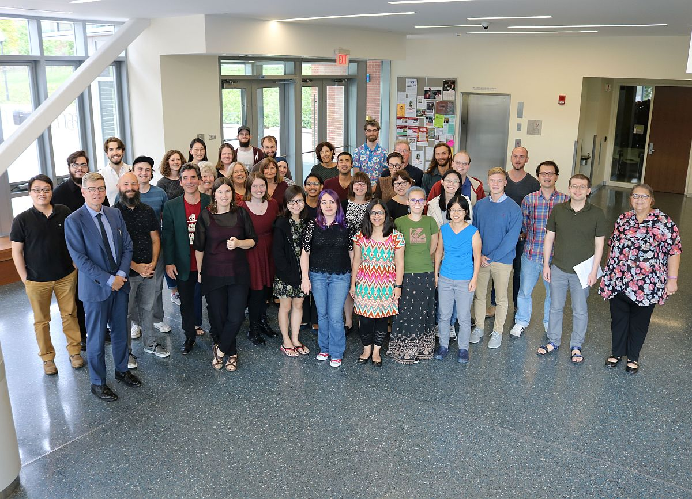

 [^placeholder image: here, a blurb about joint labs] 

**Joint lab meetings for Fall 2018 will be held in the Integrative Learning Center, Room N451, every other Thursday at 4 PM starting September 6.**

## Current Research

We're in the process of uploading old research (including resources like papers, scripts, and stimuli) to the [Open Science Framework](https://osf.io/), with the ultimate goal of making our work publically accessible and reproducible. You can find our work on the [Joint Labs](https://osf.io/vr7gu/), [CSL](osf.io/8rcwh/), and [Phonetics Lab](https://osf.io/jbvfr/) projects.

---

## Project layout

**This is a test! For full documentation visit [mkdocs.org](http://mkdocs.org).**

This is a static website conjured from markdown files. You can find them on the Joint Labs OSF (under Lab Documentation). 

    mkdocs.yml 	# The configuration file.
    docs/
        index.md  # The documentation homepage.	
        ...       # Other markdown pages.
        images/
        	...	  # Images, e.g. 
        resources/
        	...	  # Assorted pdfs, notebooks, other resources.
        	scripts/ 
        		... # Assorted scripts. 

### How to use this site

Use the search bar!!!!!!!

